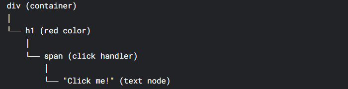
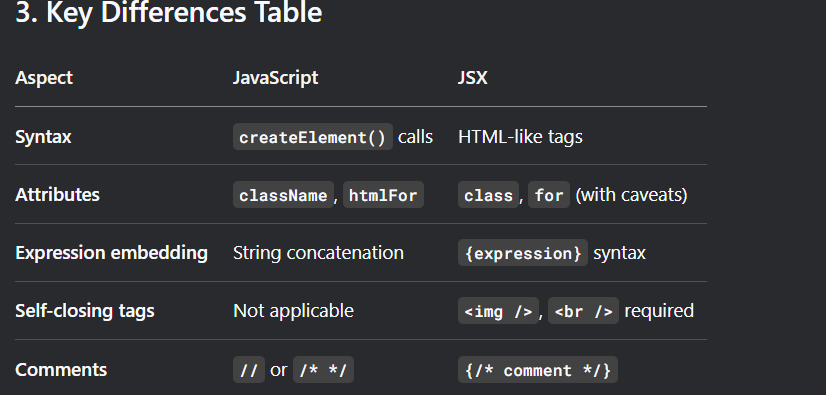

# Lession 1 (React Intro)

**Why React?**

- used to create complex frontend applications ( Ek button click se bahut jagah changes ko reflect karne ke liye)
- Can't JS be used? It can be used but React makes it easy

- ***Ultimately React Ka Code Convert to HTML,CSS aur JS mein hi hoga***

**Is React a library or Framework ( Like Angular\Vue )?**

- A library because wo sirf user interface banane mein kaam ata hai . Framework bahut strict hote hai apne rules ko leke ki ye aise hi hoga wo waise hi hoga, mera hi state mangement , routing use hoga etc etc
- Library mein aisa ni hota
- React tumhe freedom deta hai. Routing ke liye React Router, state ke liye Redus/Zustand, etc. alag se choose kar sakte ho.
- Framework mein sab kuch already fixed hota hai — usi ka routing, usi ka state management use karna padta hai.

**Add On In React**

- State Management ( By default ni tha) ( Redux,Context API)
- Routing ( By default ni hai)

# Lession 2 ( Create React App)

- npx creat-react-app project_name ( bahut zyada cheezein install kardeta hai jo need bhi ni hai) ( Npx - node package executer)
- npm run start se code start
- npm run build se code build hota hai ( HTML,CSS aur JS) mein aur ye folder serve hota hai users ko

```javascript
npm run build kya karta hai?
Ye command ek production-ready build create karta hai tumhare pure React app ka. Ye build:

Optimized hoti hai (chota size, fast loading).

Static files (HTML, CSS, JS) generate karti hai.

"build" naam ka folder banata hai jismein ye saari files hoti hain.
```

- **But we will use vite** 
- Vite is a bundler
- npm create vite@latest


# Lession 3 ( React Flow )

- **Foundation Rule** - JS akela exist karta hai agar use website pe chalana hai to script tag se inject karna hi padega (in normal vanilla applications )

- Folder Structure for npx create-react-app

my-app/
├── node_modules/          # Saare dependencies
├── public/                # Static files
│   ├── index.html         # Main HTML template
│   ├── favicon.ico        # Website icon
│   └── manifest.json      # PWA ke liye
├── src/                   # Source Code (Yahan tum mostly kaam karoge)
│   ├── App.js             # Main App Component
│   ├── App.css            # App ka styling
│   ├── index.js           # Entry point (ReactDOM.render yahan hai)
│   ├── index.css          # Global CSS
│   └── logo.svg           # React logo
├── package.json           # Dependencies & scripts
├── package-lock.json      # Exact versions lock
└── README.md              # Documentation

- Folder structure for npm create vite@latest my-app

my-app/
├── node_modules/          # Saare dependencies
├── public/                # Static assets (images, fonts, etc.)
│   └── vite.svg           # Vite logo
├── src/                   # Source Code
│   ├── App.jsx            # Main App Component (JSX extension)
│   ├── App.css            # App ka styling
│   ├── index.css          # Global CSS
│   ├── main.jsx           # Entry point (ReactDOM.createRoot yahan hai)
│   └── assets/            # Images, icons (e.g., react.svg)
├── index.html             # Main HTML (public nahi, root mein hai!)
├── vite.config.js         # Vite configuration (fast build/dev)
├── package.json           # Dependencies & scripts
├── package-lock.json      # Exact versions lock
└── README.md              # Documentation

**Difference between package.json vs package-lock.json**

Zaroori Baat:
package-lock.json ko kabhi ignore mat karo ya delete mat karo. Isse guarantee hoti hai ki sabke pass same dependencies hain.

Jab bhi npm install chalaoge, ***npm pehle package-lock.json dekhega exact versions ke liye (if available)***. Agar ***nahi*** hai, toh woh ***package.json*** ke range se latest version lega.

package.json → Batata hai kya chahiye
package-lock.json → Batata hai exact kaunsa version install hua hai

```javascript

1. package.json (The Manifest File)
Yeh tum manually define karte ho. Isme tum batate ho ki tumhare project ko konsi packages chahiye.

Isme version range hota hai (e.g., ^4.18.2 → means "4.18.2 ya usse upar ka version lelo").

Isme scripts, project name, description, etc. bhi hote hain.

Example:

json
{
  "name": "my-app",
  "dependencies": {
    "react": "^18.2.0",    // 18.2.0 ya uska koi bhi newer minor/patch version
    "react-dom": "^18.2.0"
  }
}

2. package-lock.json (The Lock File)
Yeh automatically generate hoti hai when you install packages (npm install).

Yeh exact versions store karti hai jo tumhare project mein currently installed hain (e.g., 18.2.0 exactly).

Yeh ensure karti hai ki har developer ya production server same exact versions install kare.

Example:

json
{
  "name": "my-app",
  "dependencies": {
    "react": {
      "version": "18.2.0",    // Exact version
      "resolved": "https://registry.npmjs.org/react/-/react-18.2.0.tgz",
    },
    "react-dom": {
      "version": "18.2.0",
      "resolved": "https://registry.npmjs.org/react-dom/-/react-dom-18.2.0.tgz",
    }
  }
}

```

## Why React Is a SPA by default?

- Because ek hi page hota hai index.html

### In the case of npx you dont see any script added in the html? Fir kaise wo inject ho rha

- Answer is npx mein package.json mein you will see react-script karke wo add karta hai script chupke se ( sirf yahi ni balki bahut cheezein jo tumne ni likhi hoti apne code mein)


***React Basically Kahta hai Mujhe functions do jo return kar rha hai HTML main use render kar dunga***

Components ke liye .jsx ( lekin koi mandatory ni hai Vite wali force karegi rakhne ko ) - Lekin Capitalise Naam hona zaruri hai


# Lession 4 ( Personalized React VVV IMPORTANT ) - How React Works Internally


**Dekh bhai seedha seedha react kya karta hai use ek function do jo ki return kar rha hoga html like structure jise wo convert karega in khud ke understandable object form mein ( tree banaega basically ) aur fir use apne render method pe pass karke root mein jod dega**


- Ab ye upar wala scene kaise ho rha iske liye we follow the below steps

- customRender or react 
- how that function and its html is converted into objects
- how to render the objects directly
- evaluated expression


### React Internal Render Function

```javascript

import React from 'react';
import ReactDOM from 'react-dom/client';

const App = () => <h1>Hello World</h1>;

// Modern React (v18+)
const root = ReactDOM.createRoot(document.getElementById('root'));
root.render(<App />);
```

### Custom render function


### NOTE CHILDREN HAMESHA PROP KE ANDAR HONGE ( VIRUTAL DOM WALA EXAMPLE MEIN THORE CHANGES KAR DENA)
```javascript
// Simple custom render implementation
function customRender(reactElement, container) {
  const domElement = document.createElement(reactElement.type);
  
  // Set attributes
  Object.keys(reactElement.props).forEach(prop => {
    if (prop !== 'children') {
      domElement.setAttribute(prop, reactElement.props[prop]);
    }
  });
  
  // Handle children
  reactElement.props.children?.forEach(child => {
    if (typeof child === 'string') {
      domElement.appendChild(document.createTextNode(child));
    } else {

      // Ye dekho recursion ho rha tree ban rha 
      customRender(child, domElement);
    }
  });
  
  container.appendChild(domElement);
}

Ye jo upar likha hai wo convert ismein hoga ( is type ke object mein ) - Is case mein ( ek div hai uska bacha hai h1)
// Usage
const reactElement = {
  type: 'div',
  props: {
    className: 'container',
    children: [
      {
        type: 'h1',
        props: {
          children: ['Hello World']
        }
      }
    ]
  }
};

customRender(reactElement, document.getElementById('root'));
```

### 2. How JSX Gets Converted to Objects

```javascript
const element = <div className="container">Hello {name}</div>;

// same cheez ko react se banana ho to aise banao
const element = React.createElement(
  'div',
  { className: 'container' },
  'Hello ',
  name
);

// Which produces this object:
{
  type: 'div',
  props: {
    className: 'container',
    children: [
      'Hello ',
      { /* evaluated value of name variable */ }
    ]
  }
}
```


### Official Documentation

createElement(type, props, ...children) 

type - string , html tags, components ya function 
props - mein attribute tag ya function ke parameter, style , event handler
children - mein baaki bacha kuch ya fir se , createElement ( )

***Recursively likh sakte isisliye tree banta hai***

Example
```javascript
createElement(
  'somethin',
  {props},
  createElement(
    'something2',
    {props2},
    createElement(
      .. and so on
    )
  )
)

// Aapka example perfect hai:
React.createElement(
  'div', 
  {className: 'container'},
  React.createElement(
    'h1',
    {style: {color: 'red'}},
    React.createElement(
      'span',
      {onClick: handleClick},
      'Click me!'
    )
  )
)

// Final tree structure:
{
  type: 'div',
  props: {
    className: 'container',
    children: {
      type: 'h1',
      props: {
        style: {color: 'red'},
        children: {
          type: 'span',
          props: {
            onClick: handleClick,
            children: 'Click me!'
          }
        }
      }
    }
  }
}


```

#### Recursive createElement calls hi pure UI ka tree structure banati hain, jisse React efficiently update aur render kar pata hai! 🌳✨
#### Isi recursive nature ki wajah se React itna powerful aur flexible hai! 🚀


// type do , fir props in {} fir children jitne bhi ho

```javascript

import { createElement } from 'react';

function Greeting({ name }) {
  return createElement(
    'h1',
    { className: 'greeting' },
    'Hello ',
    createElement('i', null, name),
    '. Welcome!'
  );
}

export default function App() {
  return createElement(
    Greeting,
    { name: 'Taylor' }
  );
}

Ao samjhthe hai 


```
- React ne kaha mujhe tum Greeting naam ka function do mein use render kardunga
- Thik bhai maine greeting naam ka function bana liya
- jo ki leta hai ek parameter name naam ka
- ok thik hai ab kya krna hai mujhe ek object banana hai jismein ek h1 hoga aur uske andar ek i naam ka child hoga
- thik hai bhai to simple object apne tareeqe se to work karega ni react specific object banana padega thik bhai banate hai
- createElement se banega object , wo kya leta hai as input ( type of tag ( h1,h2,....), properties like className , style etc,...childred)
- bas ye teen chezein hi leta hai
- Hamre case mein parent h1 hua jiski class greeting hai aur fir uske 3 child ( hello -> text node , fir ek child (i wala tag jiska sirf naam hai) aur akhiri welcome-> text node)
- Thik bhai maine greeting to bana diya ab
- thik bhai to main app bana deta hun
- app kya leta hai Greeting type aur property hai name naam ki
- bas yahin return kardeta hun aur main file mujhe root mein jod degi

### Ek question {} iske andar ham sirf evaluated expression hi kyun de sakte ? ( log to kahte hai iske andar js likh sakte ho )
### Answer - Dekho bhai ultimately createElement hi to run ho rha hai?? aur wo kya expect karta hai object na , kya tumne dekha hai kahin object mein if else noob


### Why react is so fast aur wo sirf changes ko hi render kyun karta naaki poore html ko lets see

```javascript

Pehla Render (Initial State - count = 0):
jsx
function Counter() {
  const [count, setCount] = React.useState(0);
  
  return React.createElement('div', {className: 'counter'},
    React.createElement('h1', null, `Count: ${count}`),
    React.createElement('button', 
      { onClick: () => setCount(count + 1) },
      'Increment'
    )
  );
}

// Virtual DOM Structure (Pehle render pe):
{
  type: 'div',
  props: { className: 'counter',
  children: [
    {
      type: 'h1',
      props: {children: ['Count: 0']}  // 📌 Initial value
    },
    {
      type: 'button',
      props: 
      { onClick: function, // 📌 Click handler
        children: ['Increment']
      } 
    }
  ]
  }
}
🎯 Button Click ke Baad (count = 1):
Naya Virtual DOM:
jsx
// setCount(count + 1) call ke baad
{
  type: 'div',
  props: { className: 'counter',
  children: [
    {
      type: 'h1',
      props: {children: ['Count: 1']}  // ✅ YAHAN CHANGE HUA
    },
    {
      type: 'button',
      props: 
      { onClick: function ,  // ✅ Same function (but different reference)
        children: ['Increment']  
           // ✅ Same text
      }
    }
  ]
  }
}
🔍 React Ka Comparison:
```
### Step-by-Step Diffing Algo:

### YAAR YE CHILDREN PROPS KE ANDAR HONGE BAHAR NI DHYAN RAKHNA

```javascript
// React compare karega:

// OLD Virtual DOM:          NEW Virtual DOM:
// {                         {
//   type: 'div',            type: 'div',           ✅ SAME
//   props: {                props: {               ✅ SAME
//     className: 'counter',    className: 'counter',
//                         
//   children: [             children: [            ✅ SAME Array
//     {                       {
//       type: 'h1',            type: 'h1',         ✅ SAME
//       props: null,           props: null,        ✅ SAME  
//       children: [            children: [         ❌ DIFFERENT!
//         'Count: 0'             'Count: 1'        📌 TEXT CHANGE
//       ]                      ]
//     },                     },
//     {                       {
//       type: 'button',        type: 'button',     ✅ SAME
//       props: {               props: {            ⚠️ COMPARE DEEPER
//         onClick: fn1           onClick: fn2      ❌ Different function reference
//       },                      },
//       children: [            children: [         ✅ SAME
//         'Increment'            'Increment'
//       ]                      ]
//     }                     }
//   ]                      ]
// }                         }
⚡ Efficient Update Kaise Hota Hai:
React Sirf YEHI Changes Karega:
javascript
// Real DOM mein:
const h1Element = document.querySelector('.counter h1');
h1Element.textContent = 'Count: 1';  // ✅ Sirf text change

// Button element same hi rahega
// Div element same hi rahega
// Class same hi rahegi
Event Handler Optimization:
javascript
// React samajhta hai ki:
// onClick function ka REFERENCE alag hai but
// FUNCTIONALITY same hai isliye
// ❌ Naya event listener add karne ki jarurat nahi
// ✅ Purana event listener kaam karta rahega
🎯 Final DOM Update:
Before Click:

html
<div class="counter">
  <h1>Count: 0</h1>
  <button>Increment</button>
</div>
After Click:

html
<div class="counter">
  <h1>Count: 1</h1>     <!-- ONLY THIS TEXT CHANGED! -->
  <button>Increment</button>
</div>
✅ Why This is Efficient:
✅ No element replacement - same <h1> and <button> elements

✅ No re-rendering of entire component

✅ Only text content update in the h1 element

✅ No style recalculations

✅ No layout shifts

❌ Without React (Inefficient Way):
javascript
// Pure JavaScript mein aisa karna padta:
button.addEventListener('click', () => {
  // Poora h1 element replace karna padta
  const oldH1 = document.querySelector('.counter h1');
  const newH1 = document.createElement('h1');
  newH1.textContent = `Count: ${count + 1}`;
  oldH1.parentNode.replaceChild(newH1, oldH1);
  
  // 👎 Inefficient: Element recreation, style recalculation, etc.
});
React isliye fast hai kyunki woh sirf minimum necessary changes karta hai! 🚀
```

### How JSX is Different from JS


- JSX (JavaScript XML) is a syntax extension for JavaScript that allows you to write HTML-like code within JavaScript. It's primarily used with React to describe what the UI should look like.

```javascript

// Pure JavaScript DOM creation
const element = document.createElement('h1');
element.className = 'title';
element.textContent = 'Hello, World!';

// JSX equivalent
const element = <h1 className="title">Hello, World!</h1>;
```

**JSX gets compiled to regular JavaScript:**

```javascript
// Input JSX
const greeting = <div className="welcome">Hello {name}!</div>;

// Compiled JavaScript output
const greeting = React.createElement(
  'div',
  { className: 'welcome' },
  'Hello ',
  name,
  '!'
);



```


### What does Babel do?

***Babel React ke JSX code ko regular JavaScript mein convert karta hai jo har browser samajh sakta hai!***

1. JSX → JavaScript Conversion

```jsx
// Aapka React code:
function App() {
  return (
    <div className="container">
      <h1>Hello World</h1>
      <button onClick={() => console.log('Clicked')}>
        Click me
      </button>
    </div>
  );
}
```

After babel

```javascript
function App(){
  return React.createElement(
  'div',
  {className:'container'},
  React.createElement('h1',null,'Hello World'),
  React.createElement(
    'button',{
    onClick : () => console.log('Clicked')}, 'Click Me')
    )
}

```

Babel React Developer ke liye yeh kaam karta hai:

✅ JSX → JavaScript convert karta hai

✅ Naye features purane browsers mein chalata hai

✅ Code optimize karta hai

✅ Import/Export handle karta hai

✅ Error checking karta hai


### Babel ke bina react ka code browser mein chalega hi ni ( khud se ) lekin haan ap babel converted code bana sakte ho

# Lession 5 ( Hooks in React 02counter)

- Why hooks? - Bina hooks ke tumhe har jagah jake use update karna hoga variable ko ( state ko )
- with hooks - react kahta hai agar ye variable(state) change hua to main uski sari jagah mein changes kardunga tumhe khud se kuch ni karna


# Lession 6 ( Virtual DOM, Fibre and Reconcilitation )


- Kayde se fibre is more complex lekin thik hai abhi itna ( LinkedList banata hai wo backend mein )

- Reconciliation is the combined process of ( Virtual DOM creation + diffing + fibre) ( actual dom update commit phase mein hota ) ( lekin losely tum kah sakte ki yahan hoga)
- ***Reconciliation is about figuring out the minimal set of changes (using VDOM creation, diffing, Fiber scheduling). The actual DOM update happens in the Commit phase.***

### STORY( Example )

- Dekh bhai ek story ya use case ke samjhata hun

- Manlo mere pas ek counter variable hai jo ki 5 jagah change ho rha hai
- to normal JS mein hame 5 ref ( documnet.g) se lene padenge aur unhe change karke tree mein dalna hoga ( DOM )
- lekin React kahta hai agar tune mujhe is counter variable ki zimmedari di to main uske har jagah update kardung tujhe kuch ni karna
- React ye karta hai useState se 
- Thik hai to hota kaise hai
- Manlo abhi 5chon jagah counter = 0 hai to ek vdom banaya react ne thik hai

- ab maine use update kar diya counter = 1

**Virtual DOM**

- ab ek aur virutal dom banega jahan counter change ho chuka hai ( with 1)

**Diffing**

- ab diffing algo se dekhega react ki kahan kahan changes karne hai (jahan differ karenge dono dom wahan change karunga aur kahin ni)

**Fibre**

- Fibre ( yahin dimaag ) - ye decide karega ki kaunsa pehle update karun ( priority etc) aur bhi cheezein karta hai lekin is use case mein priority example lete hai

**Final Step ( Actual DOM Update) - Commit Phase ( loosely part of reconciliation not exactly )**

- Bhai tere pass kya change karna hai, kisko pehle karna hai kisko baad mein karna hai ye sab pata hai to ab kya karoge, Obviously jake real DOM mein changes


### More detailed padhna zarur upar wala to sirf samjhne ke liye hai

### FIBRE

```javascript
Example: Restaurant Kitchen Analogy
Purana React (Stack Reconciler):
Ek hi chef sab kaam karta tha:

Order aaya → Chef cooking start karta

Agar beech mein naya urgent order aaya, toh bhi woh puraana order pura karke hi naya start karta

Customer wait karta rehta

Naya React (Fiber):
Smart kitchen hai multiple chefs ke saath:

Head chef decide karta kaunsi dish jyada important hai

Urgent order (jaise salad) immediately ban jata hai

Time-consuming dish (jaise biryani) thoda pause ho sakti hai

Customers ko fast service milti hai

🔧 Fiber Actually Kya Hai?
React ka naya "Brain" jo decide karta hai kaunsa kaam pehle karna hai

Task Manager jaise Windows/Android mein hota hai
```
### 💡  Fiber ke 3 Superpowers:
1. Kaam ko Todna (**Time Slicing**)
Badde kaam ko chote-chote pieces mein tod deta hai

Har 5ms mein check karta: "Koi urgent kaam hai kya?"

2. **Priority System**
High Priority: Button click, Typing (immediate response)

Low Priority: Data fetch, Heavy calculation (thoda wait kar sakta)

3. Kaam Rukna/Chalna (**Pause & Resume**)
Agar beech mein koi important kaam aaya, toh current kaam pause karke usse pehle karta hai

🎯 Real Example Samjho:
```jsx
function App() {
  const [inputValue, setInputValue] = useState('');
  const [data, setData] = useState(null);

  // Typing - HIGH PRIORITY
  const handleInput = (e) => {
    setInputValue(e.target.value); // IMMEDIATE UPDATE
  };

  // Data fetch - LOW PRIORITY  
  const fetchData = () => {
    fetch('/api/data')
      .then(res => res.json())
      .then(data => setData(data)); // CAN WAIT
  };

  return (
    <div>
      {/* Typing never gets stuck! */}
      <input value={inputValue} onChange={handleInput} />
      
      {/* Data can load later */}
      {data && <div>{data.message}</div>}
    </div>
  );
}
Fiber ye ensure karta hai:

✅ Tumhara typing kabhi bhi stuck nahi hoga

✅ Agar data fetch slow hai, toh wo background mein hoga

✅ User ko lagta hai app fast hai

🌟 Final Samajh:
Fiber = React ka Smart Manager
Jo priority ke hisaab se kaam karta hai taaki:

App smooth chale

User happy rahe

Complex apps bhi fast rahe

Bhai, ab samajh aa gaya hoga? 😊
Fiber bas itna hai ki React ko aur bhi smart bana diya!
```

### How is it connected to VDOM

```javascript
🆚 Virtual DOM vs Fiber
Virtual DOM (VDOM) - The "What"
Yeh hai ek light-weight copy of real DOM

Blueprint jaise hota hai - batata hai UI kaisa dikhna chahiye

JavaScript objects ki form mein hota hai

Fiber - The "How"
Yeh hai execution strategy - batata hai kaise aur kab updates karna hai

Worker jaise hai - jo actually mein kaam karta hai

Reconciliation algorithm ka naya version hai

🔗 Dono Kaise Kaam Karte Hain:
Step 1: Virtual DOM Banana
javascript
// React elements create Virtual DOM
const element = {
  type: 'div',
  props: {
    className: 'container',
    children: [
      {
        type: 'h1',
        props: { children: 'Hello World' }
      }
    ]
  }
};
Step 2: Fiber In Action
javascript
// Fiber iske liye yeh karta hai:
1. ✅ Virtual DOM ko analyze karo
2. ✅ Compare karo purane aur naye Virtual DOM mein
3. ✅ Decide karo kya change karna hai
4. ✅ Schedule karo kaam priority ke hisaab se
5. ✅ Finally real DOM ko update karo
🎯 Simple Analogy:
Construction Site Samjho:
Virtual DOM = Blueprint (Yeh batata hai ghar kaisa banega)

Fiber = Smart Site Manager (Yeh decide karta kaunsa kaam pehle hoga, kaise hoga)

Manager (Fiber) blueprint (VDOM) ko dekhkar:

✅ Priority decide karta: Pehle foundation, phir walls

✅ Kaam distribute karta: Multiple workers ko alag-alag tasks

✅ Progress track karta: Kaunsa kaam complete hua, kaunsa baki hai
```


### Diffing strategies

```javascript
Diffing Strategies jo Fiber Use Karta Hai:
1. Tree Diff
Overall structure compare karta hai

Agar parent change hua, toh poori branch re-render

2. Component Diff
Same type ke components optimize karta hai

ShouldComponentUpdate/PureComponent help karte hain

3. Element Diff
Individual elements compare karta hai

Keys use karta hai for list items
```

### 3 bhai 3 tabahi

```javascript

1. Virtual DOM - The "Sabse Bada Bhai" 📝
Kaam: UI ka blueprint banata hai

Example: Jaise family ka shopping list banana

2. Diffing Algorithm - The "Middle Bhai" 🔍
Kaam: Compare karta hai purani aur nayi list

Example: Dekhta hai shopping list mein kya naya add hua

3. Fiber - The "Chhotu But Smart Bhai" ⚡
Kaam: Decide karta hai shopping kis order mein karni hai

Example: Pehle roti (essential), phir chips (non-essential)


⚡ Teeno Ki Specialities:
Virtual DOM
✅ Lightweight copy of real DOM

✅ JavaScript objects ki form

✅ Fast comparison ke liye

Diffing Algorithm
✅ Efficient comparison

✅ Changes detect karta hai

✅ Minimizes DOM operations

Fiber
✅ Work prioritization

✅ Time slicing

✅ Pause/resume capability


```

### Reconciliation

```javascript
🔥 Reconciliation Process Step-by-Step:
Step 1: Virtual DOM Creation (Bada Bhai)
jsx
// React elements create Virtual DOM
const element = (
  <div className="header">
    <h1>Hello World</h1>
  </div>
);
Step 2: Diffing (Middle Bhai)
javascript
// Purana Virtual DOM vs Naya Virtual DOM compare
// Changes detect: className update, text update, etc.
Step 3: Fiber Reconciliation (Chhotu Smart Bhai)
javascript
// Fiber decide karta hai:
// - Kaunsa change important hai
// - Kis order mein update karna hai
// - Kaam ko chunks mein divide karta hai
Step 4: DOM Update (Final Execution)
javascript
// Real DOM ko efficiently update karta hai
// Only changed parts update hote hain
```

## Reconcilation vs Render vs Commit Phase

**Render phase**

React component function run karta hai → Virtual DOM banata hai.

**Reconciliation phase**

- Old VDOM vs new VDOM compare (diffing).
- Fiber decide karta hai kaunsa update kab karna hai.
- Ek “plan” ban jaata hai ki actual DOM me kya changes karne hain.

**Commit phase (Final Step) ✅**

- Jo plan bana tha, use real DOM pe apply kiya jaata hai.
- Is stage me DOM update hota hai, browser paint/reflow hota hai, aur user ko naya UI dikhta hai.


# Lession 7 ( Tailwind and Props)

**What are props?**

- Props (short for "properties") are a fundamental concept in React that allow you to pass data from parent components to child components. They are read-only and help make components reusable and dynamic.

```javascript
Basic Syntax
jsx
// Parent Component
function App() {
  return <ChildComponent name="John" age={25} />;
}

// Child Component
function ChildComponent(props) {
  return (
    <div>
      <p>Name: {props.name}</p>
      <p>Age: {props.age}</p>
    </div>
  );
}
Different Ways to Receive Props
1. Using the props Object
jsx
function User(props) {
  return (
    <div>
      <h2>{props.name}</h2>
      <p>{props.email}</p>
    </div>
  );
}
2. Destructuring Props
jsx
// Destructuring in the parameter
function User({ name, email, age }) {
  return (
    <div>
      <h2>{name}</h2>
      <p>{email} - {age} years old</p>
    </div>
  );
}

// Destructuring in the function body
function User(props) {
  const { name, email, age } = props;
  return (
    <div>
      <h2>{name}</h2>
      <p>{email}</p>
    </div>
  );
}
Types of Props
1. String Props
jsx
<Component title="Hello World" />
2. Number Props
jsx
<Component count={42} rating={4.5} />
3. Boolean Props
jsx
<Component isActive={true} showDetails={false} />
// Shorthand for true
<Component isActive />
4. Array Props
jsx
<Component items={['apple', 'banana', 'orange']} />
5. Object Props
jsx
<Component user={{ name: 'John', age: 25 }} />
6. Function Props (Callbacks)
jsx
function Parent() {
  const handleClick = () => {
    console.log('Button clicked!');
  };

  return <Child onButtonClick={handleClick} />;
}

function Child({ onButtonClick }) {
  return <button onClick={onButtonClick}>Click me</button>;
}
7. React Element/Component Props
jsx
<Container header={<Header />} content={<MainContent />} />
8. Children Prop (Special Prop)
jsx
function Card({ children, title }) {
  return (
    <div className="card">
      <h3>{title}</h3>
      <div className="card-content">
        {children}
      </div>
    </div>
  );
}

// Usage
<Card title="My Card">
  <p>This is the card content</p>
  <button>Click me</button>
</Card>
```

# Lession 8 ( Interview Counter Question)

- Man lo increment decrement wale mein tumne (increment ke case mein setCount(count+1) chaar baar likh diya) to kya hoga
- Chaar + hoga ki ek + ??

**Ek Plus hoga**

- Two methods hote hai ek simple setCount(count+1) doosra functional setCount(prevCount=>prevCount+1)
- React kya karta hai batches mein setFunctions bhejta hai
- React ke paas **state queue** hoti hai 
- First case mein [currCount+1,currCount+1,currCount+1,currCount+1]
- Doosre case mein [f(prevCount+1),f(prevCount+1),f(prevCount+1),f(prevCount+1)]

```javascript

1. Direct Way (Galat Tarika) - Behind the Scene:
jsx
const handleClick = () => {
  setCount(count + 1);  // Order 1: "0 + 1 = 1 kardo"
  setCount(count + 1);  // Order 2: "0 + 1 = 1 kardo" 
  setCount(count + 1);  // Order 3: "0 + 1 = 1 kardo"
  setCount(count + 1);  // Order 4: "0 + 1 = 1 kardo"
};
React ka Internal Process:

React ke paas ek noteboo hai: count = 0

Tumne 4 orders diye, sab mein likha hai: "current count + 1"

React sochta hai: "Current count to 0 hai, to sab 0+1=1 hi honge"

Queue: [set to 1, set to 1, set to 1, set to 1]

Process karta hai: last wala 1 set karta hai

Result: count = 1

2. Functional Way (Sahi Tarika) - Behind the Scene:
jsx
const handleClick = () => {
  setCount(prev => prev + 1);  // Order 1: "Jo bhi latest hai, usme +1 karo"
  setCount(prev => prev + 1);  // Order 2: "Jo bhi latest hai, usme +1 karo"
  setCount(prev => prev + 1);  // Order 3: "Jo bhi latest hai, usme +1 karo"
  setCount(prev => prev + 1);  // Order 4: "Jo bhi latest hai, usme +1 karo"
};
React ka Internal Process:

React ke paas ek noteboo hai: count = 0

Tumne 4 functions diye, har function ka kaam hai: "previous value lo, usme +1 karo"

React queue banata hai: [f1, f2, f3, f4] (functions ka queue)

Process karta hai:

f1 chalata hai: prev = 0 → return 1 → count = 1

f2 chalata hai: prev = 1 → return 2 → count = 2

f3 chalata hai: prev = 2 → return 3 → count = 3

f4 chalata hai: prev = 3 → return 4 → count = 4

Result: count = 4

```

# Lession 9 ( useEffect, useCallback and useRef)

- I made a password generator and used useEffect, useCallback and useRef hook in the process
- useRef kisi bhi cheez ka reference lene ke liye
- useMemo rerender se bachata hai aur value store karta hai ( )
- useCallback function ke reference ko freeze karne ke kaam ata hai 